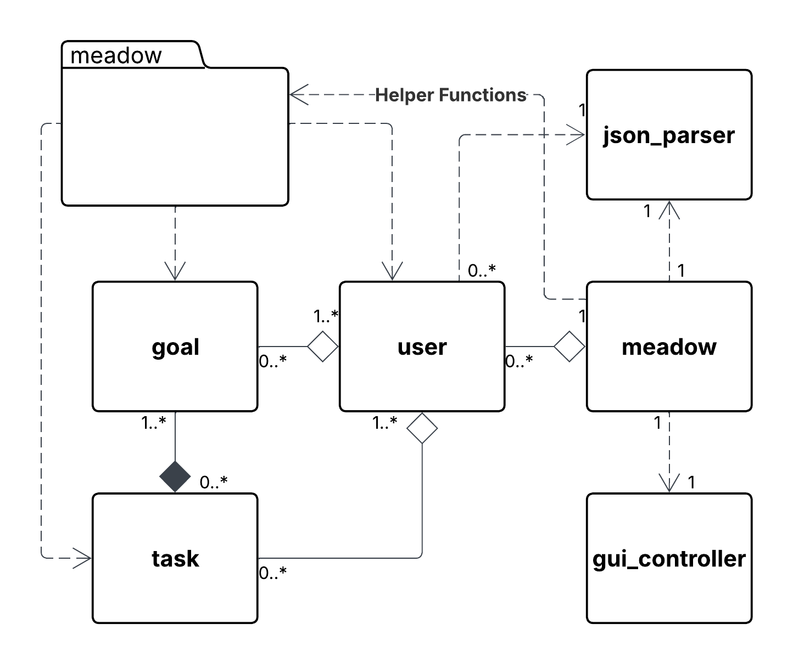
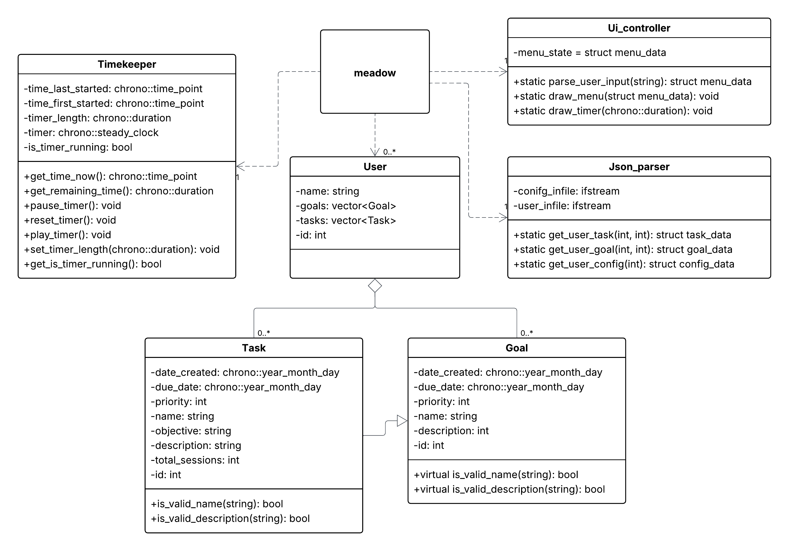

# Meadow Task Organizer Project Notebook

----

## Table of Contents

| Entry # | Entry Title                                                                                                  | Category Tag     | Working Version | Date       |
| ------- | ------------------------------------------------------------------------------------------------------------ | ---------------- | --------------- | ---------- |
| 1       | [Understanding and Navigating the Notebook](#understanding-and-navigating-the-notebook)                      | #notebook        | 0.0.0           | 2026-02-14 |
| 2       | [Creating Goals and Project Timeline](#creating-goals-and-project-timeline)                                  | #time_management | 0.0.0           | 2026-02-14 |
| 3       | [Re-Evaluating the Necessity of a Design Document](#re-evaluating-the-necessity-of-a-design-document)        | #organization    | 0.0.0           | 2026-02-15 |
| 4       | [Planning System Organization](#planning-system-organization)                                                | #planning        | 0.0.0           | 2026-02-15 |
| 5       | [Continuing System Planning Process: Diagram Revision](#continuing-system-planning-process-diagram-revision) | #planning        | 0.0.0           | 2026-02-18 |
| 6       | [Finalizing Broad System Planning](#finalizing-broad-system-planning)                                        | #planning        | 0.0.0           | 2026-02-21 |

----

## Understanding and Navigating the Notebook

### #notebook

Entry: 1
Author: Aster Lee Date: 2026-02-14 Working Version: 0.0.0

### Navigating the Notebook

- **Any standard Markdown viewer should be able to fully utilize this notebook.**
	- Section links, external links, image embedding, and tables should all be in accordance with standard Markdown syntax.
- **The table of contents contains hyperlinks for convenience.**
	- Entry titles will be hyperlinked to direct the viewer to the corresponding entry.
	- **For Obsidian users,** the vault will have bookmarks created for each entry.
- **This document should be viewed in [Obsidian](https://obsidian.md/) for best results**
	- While not vital to function, using Obsidian will provide additional functionality, such as usage of the graph view and functionality of the Tags system. 
- **Some artifacts may appear in other Markdown viewers as a consequence of missing Obsidian functionality.**
	- (e.g. A section of text may be have a preceding hash. This is from the Tag system used in Obsidian. Example: `#tagged_text`)

### Notebook Entry Formatting

**All entries will share the same heading as follows:**

* *Title* - Title of entry. Gives a specific description or focus for the entry
* *Subtitle Tag* - A subtitle that categorizes the entry into broader categories of similar entries. Takes advantage of Obsidian's tag system to easily organize and search for items.
* *Entry #* - Numerical index for entry. Helps to maintain chronological order and easy identification of entries.
* *Date* - Provides date entry was written.
* *Working version* - Indicates which version of the project the entry was working on. Follows standard [semantic versioning convention.](https://semver.org/)

### Rationale for Selecting Obsidian as a Text Editor

- **Obsidian is a strong tool for organization and workflow management.**
	- Its links, backlinks, tags, and graph view all contribute to a strongly organized system that improves workflow.
	- Less specifically, the general layout, controls, and presentation of tools all feel intuitive to me. This makes it a very appealing choice.
- **Obsidian natively supports Markdown.**
	- Obsidian uses Markdown as its standard text markup language, which vastly improves compatibility with HTML. 
		- Markdown is a markup language accepted as industry standard. It is almost universally utilized in all facets of programming, such as in README files. 
		- Writing documentation in Markdown will ensure this project's documentation is accessible to any interested party.
	- Markdown is also natively supported to be previewed in GitHub repositories. This allows users to preview all documents without having to download any files.

----

## Creating Goals and Project Timeline

### #time_management

Entry: 2 Author: Aster Lee Date: 2026-02-14 Working Version: 0.0.0

### New Project Goal

**Finish project planning and design documentation by March 6, 2026. All details should be finalized except for minor revisions that may come later. Project should be in state ready to begin software development by deadline.**

- [x] Goal addresses timeliness.
- [x] Goal specifically addresses what must be achieved.
- [x] Goal addresses what work will contribute towards.

Having a strict, yet realistic goal such as this will help to motivate me. This will ensure I'm keeping a strong pace while not overworking myself. A date of March 6 will give me 20 days, which should be more than enough to get ready even with the busy schedule I keep.

### Creating Project Timeline

Given my busy nature as an honors student, the approach I will take to time management will deviate from typical project timelines:

- Task progress will be divided into weeks.
- Each week will have a certain set of criteria that must be met by its end.

This was done to provide myself with extra flexibility. I cannot guarantee that I will always have free time to work on the project, so my plans must be able to adapt to my schedule as needed.

The final timeline is as follows:

| Week | Dates        | Tasks to Be Completed                                                                                   |
| :--- | :----------- | ------------------------------------------------------------------------------------------------------- |
| 1    | 2-14 to 2-21 | Notebook basics, begin brainstorming, create mockups                                                    |
| 2    | 2-22 to 2-28 | Finish brainstorming, create formal plans, draft pseudocode, UML diagrams, finalize system architecture |
| 3    | 3-01 to 3-06 | Finish design document in totality, finalize plans and system structure                                 |

----

## Re-Evaluating the Necessity of a Design Document

### #organization

Entry: 3 Author: Aster Lee Date: 2026-02-15 Working Version: 0.0.0

### Why reconsider?

After some time and sleep, I've questioned how useful a design document is for my purposes.

- **Design documents are useful for planning complete projects and laying out all necessary steps.**
	- My project will be far more iterative and experimental. I'm not aiming to create a final product just yet.
- **Utilizing design documents means I'll likely have to create one for every major iteration of this application. This seems untimely.**

### Weighing Pros and Cons of Design Documents

| Pros                                                   | Cons                                                         |
| ------------------------------------------------------ | ------------------------------------------------------------ |
| Encourages thoughtful designing and planning           | Requires heavy time investment                               |
| Leave little ambiguity for implementation              | I am unlikely to cooperate on this project                   |
| Thorough and robust: final product likely to be stable | Each major iteration will require a new design document      |
| Important skill for professional development           | Tedious. Could induce burnout or fatigue                     |
| Beneficial for cooperation                             | Design notebook fulfills many similar roles of design doc    |
|                                                        | Spreads my attention and focus too thin across several tasks |

After consideration, ***I have decided I will not move forwards with design documents.*** The benefits of removing them from my workload outweigh the potential benefits of maintaining them.

The timeline established in the previous entry must be revised. The revised timeline is as follows:

| Week | Dates        | Tasks to Be Completed                                                                                   |
| :--- | :----------- | ------------------------------------------------------------------------------------------------------- |
| 1    | 2-14 to 2-21 | Notebook basics, begin brainstorming, create mockups, diagram prototypes                                |
| 2    | 2-22 to 2-28 | Finish brainstorming, create formal plans, draft pseudocode, UML diagrams, finalize system architecture |
| 3    | 3-01 to 3-06 | Finalize plans and system structure. Identify necessary libraries, subsystems, helper functions, etc.   |

----

## Planning System Organization

### #planning

Entry: 4 Author: Aster Lee Date: 2026-02-15 Working Version: 0.0.0

### Goal: Brainstorm ideas and details for system organization in order to create a stronger plan for how the application will be developed.

### Ideation and Brainstorming

Before any system organization can begin, I must first consider what I need to implement into this program. Brainstorming involves considering any and all ideas that may be relevant to the overall design. Extraneous or unimportant ideas can be culled later on in the process. 

The most important considerations have been listed below.

- **Usage of the [Pomodoro Technique](https://en.wikipedia.org/wiki/Pomodoro_Technique)**
	- Studies have reinforced effectiveness for productivity
- **Hierarchy of tasks**
	- Smaller tasks contribute to greater tasks which contribute to completion of an overall goal
	- Combines with Pomodoro. User focuses on a small task to chip away at the bigger picture
- **Simple interface**
	- Several testimonies cite confusing/unappealing UI as a turn-off for some programs
	- Clean presentation, drag-and-drop controls, etc.
	- Focused approach rather than information overload
- **A prioritization system**
	- People with ADHD struggle to prioritize (empirical findings and personal experience)
	- Consider factors of immediateness and importance ([Eisenhower Matrix](https://en.wikipedia.org/wiki/Priority_Matrix))
- **Written reflections upon task/goal completion**
	- Could promote mindfulness and help to constructively improve habits. 

With these basic ideas, I created a rudimentary UML diagram to imagine how the final program might be structured. This diagram was created to be a prototype rather than any official plan. 

Creating a preliminary mockups such as this promotes more thoughtful design and can highlight potential weak points in the proposed design. 

The above diagram depicts the general concept for the application. 

- The `meadow` file exists to manage all of the interacting objects. Its sole purpose is to organize and initialize all necessary components.
- The `user` class will contain all necessary information relating to the user. Its data will be saved to JSON databases, chosen for their balance between readability and speed.
	- These databases will also save the configuration data utilized by the `meadow` file.
	- `user` also contains instances of `goal` and `task`, which naturally are the goals and tasks associated with the user.
		- The data associated with these instances will be saved into the user's corresponding JSON file
- The `goal` class exists as both a template for its child `task` class, but also to act as its own object. `goal` instances contain all relevant information for tracking their progress.
	- `goal` instances aggregate `tasks` as instance variables. This will allow for logical separation and clearly indicates which tasks work towards which goals.
- The `task` class is a child of `goal`. In its current iteration, it shares all attributes with its parent. I plan for there to be more differentiation between the two, thus justifying it being separate.

----

## Continuing System Planning Process: Diagram Revision

### #planning 

Entry: 5 Author: Aster Lee Date: 2026-02-18 Working Version: 0.0.0

A new version of the UML diagram was created. This version is simplified from the previous iteration, removing the class attributes and methods from the diagram to return the focus towards organization. Details of implementation can come later.

The most significant change made here was changing `task` from an inheritance of `goal` to a composition of `goal`. I learned of the potential drawbacks of relying upon inheritance, and determined that changing task to instead be a composition of goal was likely beneficial. Such a change ensures that changes to the parent don't cause any adverse effects to the child.

The revised UML diagram is below.

----

## Finalizing Broad System Planning

### #planning

Entry: 6 Author: Aster Lee Date: 2026-02-21 Working Version: 0.0.0

### Finalizing General System Organization

Work was done to finalize the system's general layout. Considerations were made to balance system optimization, velocity, and versatility. In order to this, the system was first evaluated from a high level to identify the bare necessities.

The above diagram is the culmination of the planning that was conducted over the course of the last week. The primary goal was simplify the system and organize as efficiently as possible.

- The entire system is organized into a namespace, which promotes intuitive organization and the ability to share common data throughout the related classes.
- Almost all classes feed into the central `Meadow` file. This was creates a logical connection where processes are all encapsulated and abstracted on their own, then assembled into a functional program in a single file. This creates a simple, yet logically sound system.
	- The natural tradeoff is that high amounts of abstraction increase the difficulty of debugging, low-level understanding, and issues with maintenance.
- `User` is now only related to the `Meadow` file and the `Goal` and `Task` classes, which serves the earlier goal of stronger encapsulation and abstraction.
- The `Goal` class is fundamentally unchanged, and is still composed by `User` as in previous iterations.
- `Task` has returned as a child of `Goal`. While composition over iteration is good practice, `Goal` objects and `Task` objects are nearly identically logically. Practically, tasks can be considered to be a more specific type of goal, so defining them as children of `Goal` makes sense as well.
- The three utility classes of `Timekeeper`, `Json_parser`, and `Gui_controller` are all important utilities accessed strictly by the `Meadow` file. These classes could also be implemented simply as namespace functions. My decision will come down to how practical it is to define them as classes in practice. For now, defining them as classes is fine organization-wise.

### Beginning Details of Implementation

With the broader details of organization in place, I created an implementation diagram to further refine how I will go about creating the application.

The purpose of this diagram is not to perfectly represent how the application will be created, but to refine and guide the process of implementation.

The diagram shows the general structure for how the program will be organized.

The diagram only shows select class attributes and methods, as many are either unnecessary to depict or difficult to predict in this early of a state.

Important to note is the change from a `Gui_controller` to a `Ui_controller`. The reason behind this comes down to simplicity: creating graphical user interface is a daunting and challenging task. Creating the backend to support the UI before it is created is far more important. For the time being, the UI will be simplified into a terminal interface with command line controls. More effort in creating GUI will come later.

Also important to note is the static nature of many of the utility classes' methods. As stated earlier, it could be more practical to define some of these utility methods as namespace functions. While namespaces simplify organization and reduce memory overhead, classes provide organized associations of data. My ultimate decision will come down to which is more practical to execute in practice. As it stands, they will remain classes.
